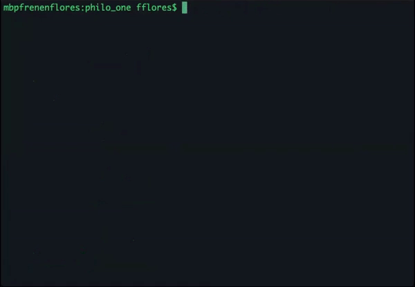
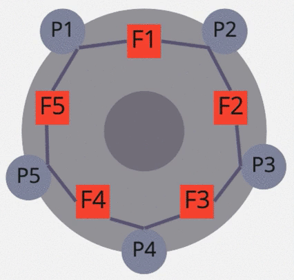

# Philosophers
## [Dining philosophers problem](https://en.wikipedia.org/wiki/Dining_philosophers_problem#:~:text=In%20computer%20science%2C%20the%20dining,and%20techniques%20for%20resolving%20them.)

>The aim of this project is to learn the basics of threading a process and get familiar with
shared memory, threads, mutex, semaphore.


### Rules


- A number of philosophers are sitting at a round table doing one of three things:
eating, thinking or sleeping.
- While eating, they are not thinking or sleeping, while sleeping, they are not eating
or thinking and of course, while thinking, they are not eating or sleeping.
- The philosophers sit at a circular table with a large bowl of spaghetti in the center.
- There are some forks on the table.
- As spaghetti is difficult to serve and eat with a single fork, it is assumed that a
philosopher must eat with two forks, one for each hand.
- The philosophers must never be starving.
- Every philosopher needs to eat.
- Philosophers don’t speak with each other.
- Philosophers don’t know when another philosopher is about to die.
- Each time a philosopher has finished eating, he will drop his forks and start sleeping.
- When a philosopher is done sleeping, he will start thinking.
- The simulation stops when a philosopher dies.
- Philosophers should avoid to die!

Each program completes the task using different methods:

- [philo_one](https://github.com/FrenkenFlores/Philosophers/tree/main/philo_one): threads and mutex
- [philo_two](https://github.com/FrenkenFlores/Philosophers/tree/main/philo_two): threads and semaphores
- [philo_three](https://github.com/FrenkenFlores/Philosophers/tree/main/philo_three): processes and semaphores

### Build

```shell
git clone https://github.com/FrenkenFlores/Philosophers
cd Philosophers
make
```
### Instructions

```shell
cd philo_one/
./philo_one number_of_philosophers time_to_die time_to_eat time_to_sleep [number_of_times_each_philosopher_must_eat]
```
- number_of_philosophers: is the number of philosophers and also the number
of forks
- time_to_die: is in milliseconds, if a philosopher doesn’t start eating ’time_to_die’
milliseconds after starting his last meal or the beginning of the simulation, it
dies
- time_to_eat: is in milliseconds and is the time it takes for a philosopher to
eat. During that time he will need to keep the two forks.
- time_to_sleep: is in milliseconds and is the time the philosopher will spend
sleeping.
- number_of_times_each_philosopher_must_eat: argument is optional, if all
philosophers eat at least ’number_of_times_each_philosopher_must_eat’ the
simulation will stop. If not specified, the simulation will stop only at the death
of a philosopher.

### Demonstration

 | 
---|---

### Resources

- https://hpc.llnl.gov/training/tutorials/introduction-parallel-computing-tutorial
- https://computing.llnl.gov/tutorials/pthreads/
- https://habr.com/ru/post/326138/
- http://www.usingcsp.com/cspbook.pdf
- https://www.cs.utexas.edu/users/EWD/ewd03xx/EWD310.PDF
- https://www.cs.utexas.edu/users/misra/scannedPdf.dir/DrinkingPhil.pdf
- https://www.ibm.com/support/knowledgecenter/SSLTBW_2.4.0/com.ibm.zos.v2r4.bpxbd00/ptcrea.htm
- http://www.ccfit.nsu.ru/~kireev/lab1/lab1time.htm
- http://www.csc.villanova.edu/~mdamian/threads/posixsem.html
- https://linux.die.net/man/7/sem_overview